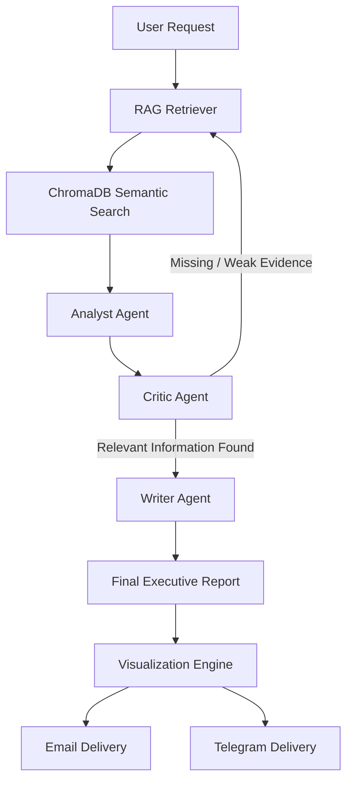
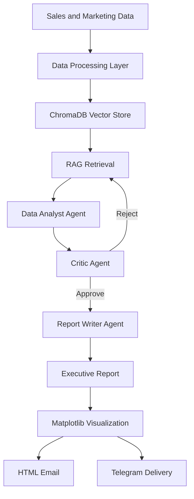
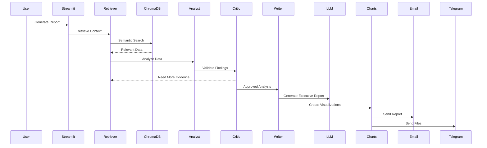

# AI Sales & Marketing Report Generator

```{=html}
<p align="center">
```
``{=html}
``{=html}
``{=html}
``{=html}
``{=html}
```{=html}
</p>
```
## Enterprise-Grade Multi-Agent RAG Reporting Platform

An AI-powered business intelligence reporting system that automatically
converts sales and marketing data into executive-ready reports using
Retrieval-Augmented Generation (RAG), multi-agent orchestration,
ChromaDB vector search, automated visualization, and multi-channel
delivery.

------------------------------------------------------------------------

# Overview

This project automates the complete reporting lifecycle:

-   Data ingestion
-   Semantic retrieval
-   Business analysis
-   Report writing
-   Report criticism and validation
-   Visualization generation
-   Email delivery
-   Telegram delivery
-   Scheduled execution

The system behaves like an AI analyst team instead of a simple chatbot.

------------------------------------------------------------------------

# Why This Project Stands Out

-   Business-focused AI automation
-   Agentic RAG architecture
-   Multi-agent collaboration
-   Critic-based quality control loop
-   Evidence-grounded reports using ChromaDB
-   Automated executive dashboards
-   Email + Telegram distribution pipeline
-   Production-style logging and scheduling

------------------------------------------------------------------------

# Updated Multi-Agent Workflow

The agent pipeline now includes a Critic Agent.


``` mermaid
flowchart TD

A[User Request] --> B[RAG Retriever]
B --> C[ChromaDB Semantic Search]

C --> D[Analyst Agent]

D --> E[Critic Agent]

E -->|Relevant Information Found| F[Writer Agent]

E -->|Missing / Weak Evidence| B

F --> G[Final Executive Report]

G --> H[Visualization Engine]

H --> I[Email Delivery]

H --> J[Telegram Delivery]
```

## Critic Agent Logic

The critic validates whether retrieved information is sufficient before
report generation.

Workflow:

1.  User requests analysis
2.  Retriever fetches relevant business records
3.  Analyst generates findings
4.  Critic checks:
    -   Is the retrieved context relevant?
    -   Are insights supported by data?
    -   Is additional retrieval required?
5.  If information is insufficient:
    -   critic sends request back to retrieval
    -   analyst re-analyzes
    -   writer waits
6.  If information is valid:
    -   writer generates final executive report

This reduces hallucination and improves report reliability.

------------------------------------------------------------------------

# System Architecture


``` mermaid
flowchart TB

DATA[Sales and Marketing Data]

DATA --> INGEST[Data Processing Layer]

INGEST --> VECTOR[ChromaDB Vector Store]

VECTOR --> RETRIEVE[RAG Retrieval]

RETRIEVE --> ANALYST[Data Analyst Agent]

ANALYST --> CRITIC[Critic Agent]

CRITIC -->|Approve| WRITER[Report Writer Agent]

CRITIC -->|Reject| RETRIEVE

WRITER --> REPORT[Executive Report]

REPORT --> CHARTS[Matplotlib Visualization]

CHARTS --> EMAIL[HTML Email]

CHARTS --> TELEGRAM[Telegram Delivery]
```

------------------------------------------------------------------------

# Technology Stack

## AI / RAG

-   Python
-   ChromaDB
-   Sentence Transformers
-   Retrieval-Augmented Generation
-   AutoGen Multi-Agent Framework
-   GROQ / OpenAI compatible LLMs

## Application

-   Streamlit
-   matplotlib
-   NumPy
-   JSON based persistence

## Delivery

-   SMTP Gmail
-   Telethon Telegram API

## Automation

-   schedule
-   asyncio
-   logging

------------------------------------------------------------------------

# Core Capabilities

## Analysis

-   Sales performance analysis
-   Marketing campaign analysis
-   Product analysis
-   Regional comparison
-   Quarterly reporting
-   Custom business questions

## Retrieval

-   Persistent vector database
-   Metadata filtering
-   Context ranking
-   Prompt-safe truncation
-   Evidence-based generation

## Visualization

Generated automatically:

-   Sales by region
-   Quarterly performance
-   Product performance
-   Marketing ROI
-   Channel performance
-   Top products
-   Growth analysis

------------------------------------------------------------------------

# Project Structure

    .
    ├── agent.py
    ├── app.py
    ├── config.py
    ├── email_sender.py
    ├── rag_retrieval.py
    ├── report_generator.py
    ├── scheduler.py
    ├── telegram_sender.py
    ├── vector_db.py
    ├── visualizations.py
    ├── data/
    ├── charts/
    ├── reports/
    ├── logs/
    ├── screenshots/
    │   ├── Report 1.png
    │   ├── Report 2.png
    │   ├── Report 3.png
    │   ├── Report 4.png
    │   └── Report 5.png
    └── README.md

------------------------------------------------------------------------

# End-to-End Execution Flow


``` mermaid
sequenceDiagram

User->>Streamlit: Generate Report

Streamlit->>Retriever: Retrieve Context

Retriever->>ChromaDB: Semantic Search

ChromaDB-->>Retriever: Relevant Data

Retriever->>Analyst: Analyze Data

Analyst->>Critic: Validate Findings

Critic-->>Retriever: Need More Evidence

Critic->>Writer: Approved Analysis

Writer->>LLM: Generate Executive Report

Writer->>Charts: Create Visualizations

Charts->>Email: Send Report

Charts->>Telegram: Send Files
```

------------------------------------------------------------------------

# Running the Project

## Start Streamlit

``` bash
streamlit run app.py
```

## Generate Reports Immediately

``` bash
python scheduler.py now
```

## Start Scheduler

``` bash
python scheduler.py
```

## Test Telegram

``` bash
python telegram_sender.py --test
```

------------------------------------------------------------------------

# Streamlit Features

The application supports:

-   Report type selection
-   Business filters
-   Live report generation
-   Chart preview
-   Report download
-   Email sending
-   Telegram sending

------------------------------------------------------------------------

# Screenshots

The repository contains application screenshots:

``` html
<p align="center">

</p>

<p align="center">

</p>

<p align="center">

</p>

<p align="center">

</p>

<p align="center">

</p>
```

------------------------------------------------------------------------

# Operational Features

-   AutoGen preferred execution
-   GROQ fallback generation
-   Critic verification loop
-   Logging
-   Retry handling
-   Cleanup service
-   Scheduled reporting
-   Run history tracking

------------------------------------------------------------------------

# Security

-   Never commit `.env`
-   Store API keys securely
-   Rotate credentials
-   Restrict delivery credentials
-   Avoid indexing sensitive information

------------------------------------------------------------------------

# Future Improvements

-   Role-based delivery
-   Hybrid vector + keyword search
-   PDF report export
-   Human approval workflow
-   Advanced audit tracking
-   Historical report dashboard

------------------------------------------------------------------------

# License

MIT License

------------------------------------------------------------------------

# Final Note

This project demonstrates a production-oriented AI reporting workflow
where multiple agents collaborate:

Retriever → Analyst → Critic → Writer → Visualization → Delivery

The addition of the Critic Agent creates a self-checking reporting
pipeline that improves reliability, reduces hallucination, and makes the
system closer to a real enterprise AI analyst workflow.
